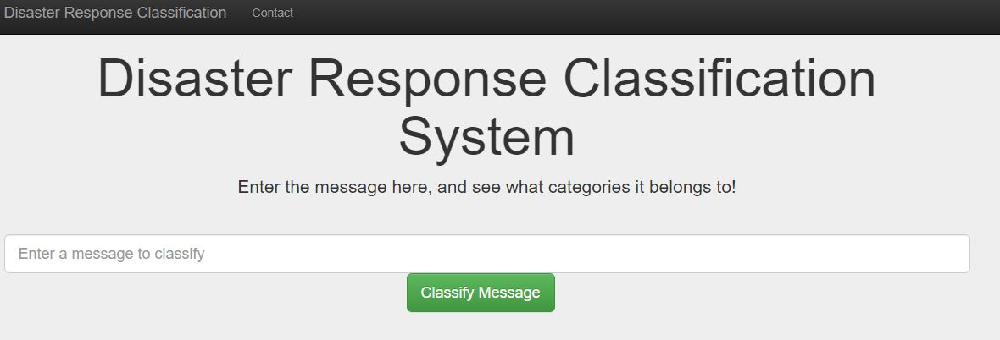
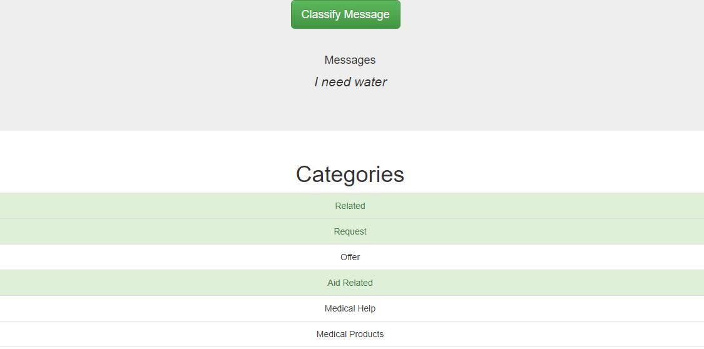

# Disaster Response Classification System

## Introduction

In this project, we aims to design a web-based disaster response classification system which labels
specific message with different categories. The projects can be divided into the following steps:

1. Establishing an ETL pipeline to gather the raw data, wrangle the data and store the data in a database.

2. Creating a machine learning pipeline to correctly classify the disaster response

3. Developing a web app to classify disaster response messages in real time.

## Getting started

### Dependencies

n order to use the project, you need the following python packages:
1. numpy, pandas
2. sklearn, nltk
3. SQLAlchemy
4. flask, plotly

### Installing

Clone this repository:
'git clone https://github.com/Yuzhe17/Disaster-responses-system-development.git'

### Executing the program
To execute the ETL pipeline, run 'process_data.py 'data/disaster_messages.csv' 'data/disaster_categories.csv' 'disaster_response.db''

To execute the machine learning pipeline, run 'train_classifier.py 'disaster_response.db' 'model/classifier.pkl''

To deploy the web app, go the DisasterResponse_app and run the run.py, and go to 
[http://localhost:3001/index](http://localhost:3001/index)

## Files
1. DisasterResponse_app/templates/go.html: a html file which displays the classification result

2. DisasterResponse_app/templates/master.html: a html file which displays the visualizations of the data

3. DisasterResponse_app/custom_transformers.py: a python scripts containing custom sklearn transformers

4. DisasterResponse/run.py: a python script containing web app initiation and routes

5. data/: a folder containing two csv files of meassages and categories of all disaster responses

6. model/classifier.pkl: pickle file of a sklearn classifier

7. process_data.py: a python script implementing an ETL pipeline

8. train_classifier.py: a python script implementing a machine learning pipeline

9. disaster_response.db: a sqlite database storing all the disaster response messages and categories

## Screenshots

## Acknowledgements
Thanks to [figure eight](https://appen.com/) for providing the dataset

